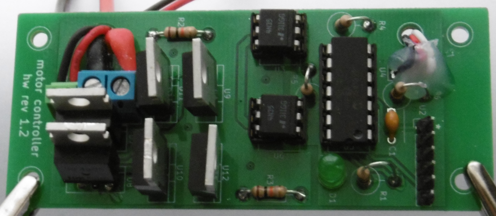

## MotorController [](https://travis-ci.org/francois-berder/MotorController)

MotorController is a small board which mostly consists of a PIC16F1825 and a H-bridge to control one motor.
The PIC uses the same [protocol than a servo](https://en.wikipedia.org/wiki/Servo_control) so you can plug this board directly to a radio receptor.
Kicad files are available in ```controller.zip```. This archive also contains the ZIP file that I sent to Seeedstudio to make the PCB.



### How to build

```bash
$ git submodule init
$ git submodule update
$ make
```
You can also run ```make debug``` if you want to compile assertions.
Note that you only need to update the git submodule once.


This creates firmware.hex in ```bin/``` folder.

### Firmware description

When the PIC starts running, it computes the neutral position. This takes a few seconds as it computes the average of 72 to 96 entries. During these moments, do **not** touch your radio. The LED will be blinking fast during this operation. Once this is finished, the PIC flashes the LED every 2-3 seconds.

The PIC will reset if:
   - no data was received for one second (watchdog resets PIC)
   - too many invalid data have been received

Signal from the radio is converted as a number which, if valid, is in range 450..1050. Any number out of this range is considered invalid. Neutral position is expected to be around 750. Hence, there are approximately 300 different positions in each direction. The PWM output precision is 8 bits. Any number greater than 255 is capped. Also, the PIC will stop the motor if numbers are in range neutral-min_power..neutral+min_power.
The firmware takes about 1 second from full stop to maximum speed. You can adjust this behavior by changing values in ```config.h```.

All of these numbers are dependent on the clock speed of the PIC. The firmware configures the PIC to use its internal oscillator at 2MHz. This is the minimum clock speed to ensure that the PWM output precision is 8 bits.

Beware that the interrupt handler responsible for converting a radio signal to a number is **very** time sensitive. I had to disable all other interrupts (that is why the LED is not flashing during operation) to ensure that the firmware would always work. Otherwise, the motor would be turned on randomly for brief periods.

### Power consumption

Using a multimeter, it was found that the board takes about 2.5mA during initialisation, then 570uA was measured in idle (motor is not turning).
If you want to save more power at the expense of motor control precision, you can lower the clock speed. Also, you can switch off the LED in the firmware.

### EEPROM layout


If the firmware is built in release mode (default), then a python script modifies the hex file to store information in the EEPROM.

| offset | size | description |
| ------ | ---- | ----------- |
|   0    |   8  | UNIX UTC release timestamp in big endian |
|   8    |   4  | XC8 compiler version in ASCII e.g. "1.42" |
|   12   |  20  | SHA1 hash of last commit of MotorController |

### BOM

|    part    | quantity |
| ---------- | -------- |
| PIC16F1825 | 1 |
| 4N35       | 2 |
| 14 pin DIL header | 1 |
| 6 DIL header | 2 |
| IRLB8748   | 4 |
| IRF4905    | 2 |
| LED 5mm    | 1 |
| 100nF capacitor | 1 |
| 10k resistor | 2 |
| 470ohm resistor | 2 |
| 2.2k resistor | 1 |
| 1k resistor | 1 |
| 1x6 pin header | 1 |
| block terminal 2.54mm | 1 |
| block terminal 5.08mm | 1 |
